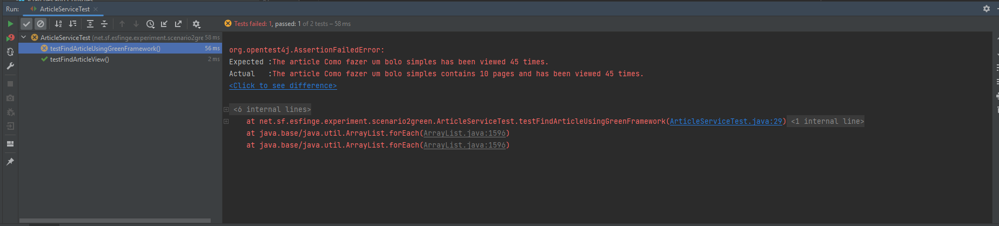

# 📰 Article View Counter – Greensfinge Experiment

This project simulates an article view counter, commonly used in blogs or content platforms. It is part of an experiment to demonstrate how energy-saving strategies can be integrated into Java applications using the **Greensfinge Framework**.

## 📦 Project Structure

The project follows a simple architecture with a service, entity and repository.

## ✅ Description

- `entity.Article`: Contains the business entity class.
- `service.ArticleService`: Contains the business logic to format the article view message.
- `repository.ArticleRepository`: Simulates a database to search the values.

## 🧪 Unit Tests

The test class `ArticleServiceTest` validates the behavior of the logic for adding articles:

In this task, you will see something like this, and the goal is to make all tests pass successfully.

